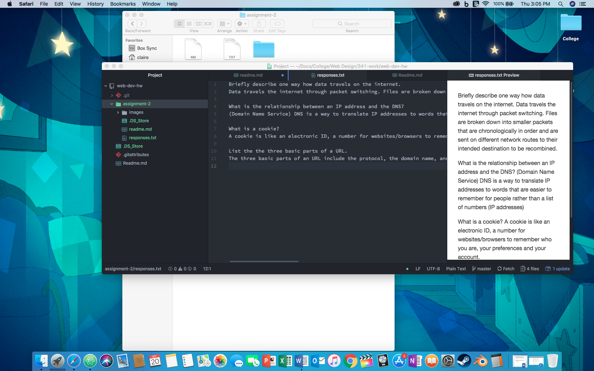

## Assignment 2 Read Me

### Version Control System
- Track changes over time
- Duplications can be made for experimental coding that won't break the final code.
- Collaboration
- Stay organized
- Increase efficiency

[My Response Text](/responses.txt)

### Summary
I had to rename my repo as I made one during the first week of class for the first assignment. Then I reviewed the material on the course website. The infomation on [Best Naming Practices](https://media-ed-online.github.io/intro-web-dev/topic-02/naming-practices/) and how to organize directories and files was very interesting. I appreciate the teacher for explaining it.

