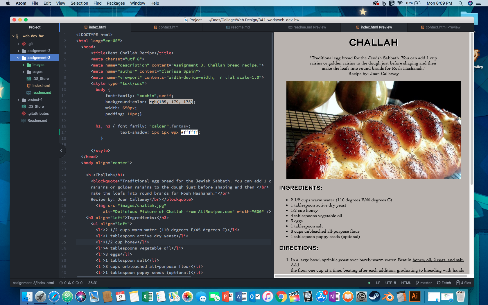

# Assignment 3 README

### Question 1
An html document can only have one head and one body element on each page. Otherwise, you'll start to have quite a few problems, namely the browser wouldn't be able to display the page.
The head element includes the important/sensitive bits of the page, its usually hidden from client computers and available to browsers/processors. The head element is the 'thoughts' of the page.
On the other hand body elements is the meat and potatos of the page. Its the content people are looking for when searching for information on the world wide web. Content within the body element is displayed publicly on client computers.

### Question 2
Structural Markup embeds information about the structure of the document, including headings, paragraphs, breaks, and lists. While Semantic markup reinforces the meaning of the text in a documument and places emphasis on words.

### Summary
This week I went and reviewed html elements from the class website. First I created a new path of files from my website root directory. I had taken notes of everything from the class website and followed along to this week's requirements. I wanted to challenge myself more and added a few css/style elements in the Head. My genuine goal with the site was to have the main portion of the text (ingredients and directions) be flushed left, but have all the elements of the site actually be centered in the browser. I couldn't figure out how to do that, but I understood how to add width and padding to the body. I also figured out how to add a drop shadow to the text, I felt that it needed to pop out more. In the future I would like to understand stylesheets more and how to incorporate them in my code.

I added this to the style element:
```h1, h3 { font-family: "calder",fantasy;
          text-shadow: 1px 1px 0px #ffffff;
  }```

I'm trying my best to understand how to write 'polite code'. I think I would have to read more lines of html code myself to actually understand.

