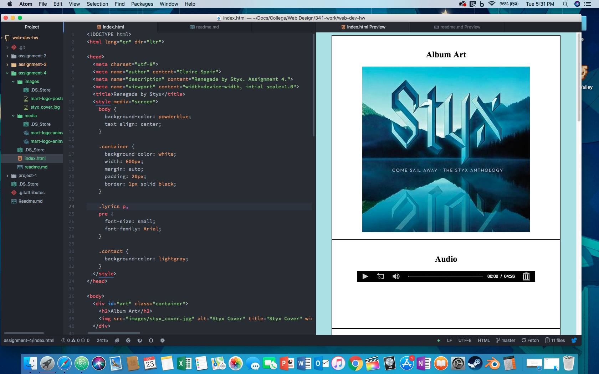

## Assignment 4 Read Me
### Clarissa Spain

 Differences |
--|--
divs  |  Block level element. Best way to divide the html page and its contents
classes  |  Are added for css styling or read by other languages. Also groups similar types of elemts together.
spans  |  Used for inline styling
ids  | (Global Attribute) Used to name divs. Importanat for any element that's styled independently.

- Alt text is a description to image elements for the visually impaired.

### Summary of Work
This week I reviewed the best way to manage media on a webpage as so clients and their browsers have the best experience. Then the best way to build a page. Furthermore, learned the important iFrame element and the best way to organize and code media. Otherwise, I didn't have any more problems.

