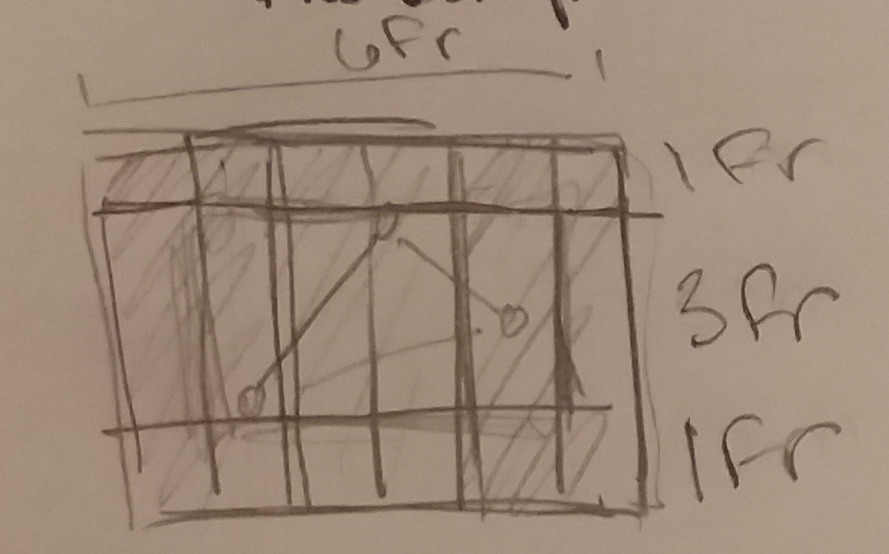

## Assignment 5 Read me

Woah ho, I can't believe that this assignment snuck up on me the way it did.
My design is based on the 50's color palette provided with the material for this class.

### Color Palette
- Red #EA5652
- Yellow #EEC003
- Blue #78E2E0

### Summary
I started this project by creating a simple wireframe sketch of the website. Then I set down my css grid parameters.
Since, project 2 I've been referring to this  [website][12261ce5] for laying out grids and tables. I decided to experiment with how to use css grid. I was having a really hard time just getting the colors show up so I went back to just making boxes.

### Screenshot Of Work
Here's my not so detailed sketch of what I was imagining for the css grid of the website. Every colomn would be a different color from my palette, but on top of that I would include one of the images provided for the project. I have no idea why I drew it like a triangle, since it's actually a star. My final design ended up not working out as I imagined, since I wasn't able to use css grid.

Actually looks like this, for clarification!

  [12261ce5]: https://css-tricks.com/snippets/css/complete-guide-grid/ "css grid"
