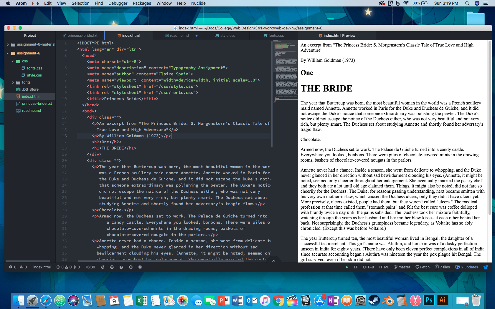

## Assignment 6 Read Me

### Design Process
I decided to look into novel/ fairytale style fonts. That's how I stumbled upon
### System font, Web font, and Web-safe font?
- System Font: Fonts already on the system, not on the web.
- Web Font: Optimized the perform on the web. Do not have to be available on the system.
- Web-safe Font: Reliable fonts, available on Windows and Mac.

### Summary
I had a great time creating this website, I had a bit of trouble getting my background tile to show up on my website. I believe it came down to some issues with linking etc. The company the link went to for my project seemed to have been taken down, so I had to find another website about The Princess Bride.

