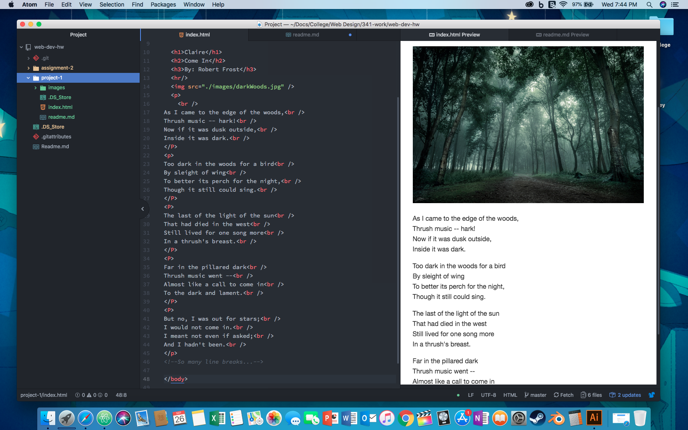

## Project 1 Read Me

### Browsers
I use Safari on my Mac and iPad, but ( since I haven't fully converted) I use Chrome on my Android. However, all through out school we were forced to use Chrome as they had student email accounts through Google.

Browsers are software programs that allow individuals to access the internet. Depending on your preferences, different browsers will appeal to those. The importance of updated Browsers could mean the difference in secure sensitive information or a hacker going on vacation with your money.

### Wayback Machine
I used the Wayback Machine to look at Google's gmail from different years. The major changes include font and simplicity. I found that it got simplier over the years and looked more professional. I would not make a gmail account back in 2005, that just looked sketchy.
### Summary
I enjoyed learning about HTML. I have a bit of experience with Markdown from previous classes and I feel that it has made the transition easier. I appreciate the comparisons in our lessons between HTML to Markdown and it's made it easier to understand. Hopefully, it will be easier to remember.

