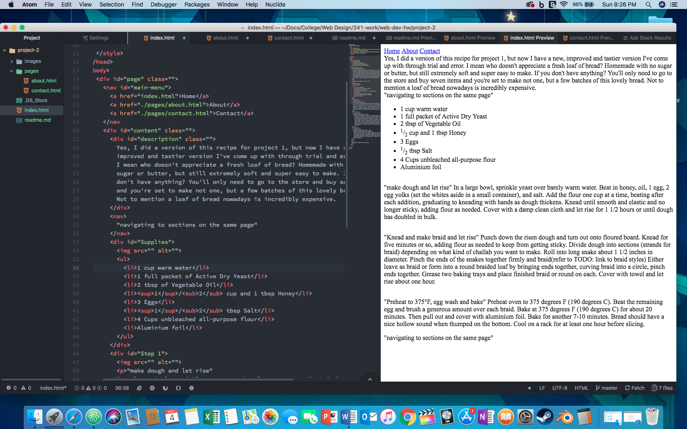

## Project 2 Read Me
So Recap: I very much enjoy web development. I initially went into Media Arts intending to graduate as just a Graphic Designer, but I have opened up to also graduating as a web developer (or maybe a Front-End-Dev?). Especially, going from Markdown to another markup language(HTML), it just clicked. Honestly, the hardest part is just remembering what attributes, elements and properties are even available at the moment I'm coding. Sometimes, I don't even realize there was a better attribute for what I was coding, and that just comes with time.

### Styling

I have been super-duper excited about getting into CSS, finally. I was going to do all the styling in the head element like asked, but I started to get overwhelmed, plus I didn't want to repeat myself in every page if elements were the same, so I made an external CSS file. I'm nervous that I did it wrong or maybe there's better ways to style different elements?

I wanted my webpage to look like a page from your great-grandma's recipe book... I'm not sure if it turned out completely that way.

But, yah, in the end it's a bit hodgepodge, but I don't mind it. 
### Work Summary
I set up my directories in my folder and then went into Atom to create the other pages. I wanted to make sure I was as clear and as consice as possible within my code. So I started with just html and content. The only thing I hadn't added at the time were images.

Then I had to stay home to take my folks to the airport and made my recipe. (And made a chocolate chip version of the recipe for dessert, mmmmm). I took my process images to photoshop for cleanup and saved them for the web and added those to my directory and html.

I did my best to cleanup my code and then dipped my toes into CSS.

