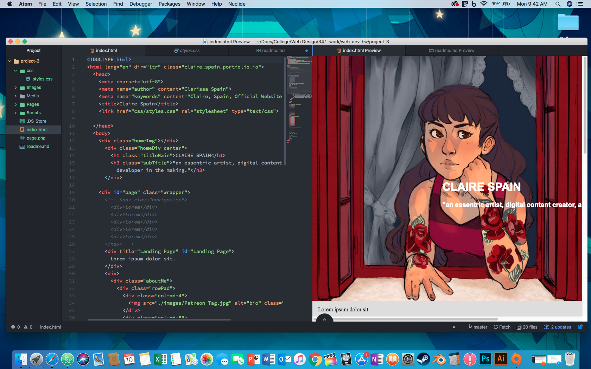

# Claire's Portfolio Read Me
Welcome to my ReadMe for my portfolio website. Here I include tidbits and misc on my latest adventures regarding the creation of the site. It's not super interesting here so I recommend visiting ``TODO: Insert website url``` instead.

However, I suppose you're still curious about how I put together the website? Well, I'm flattered, please, continue reading.

My site was intially concieved October 24, 2018 with a simple 'Hello World!' in bright yellow colored font against a black screen for the spooky Halloween season. Also, that semester altogether was my first time using HTML, CSS, and JavaScript. I'm majoring in Media Arts, but I have a secret love-life with code and after my first look at HTML I had to keep learning. Not only is this site a portfolio of my work, but its a project to further hone my skills in coding. There was so much I wanted to do and so much I wanted to learn. I started reading up on programmers, front-end-devolopers, and even started following #Coding on Instagram. I was deep.

### Difference between padding, margin, and borders?
Visually is the best way to explain the difference between these three in relationship to *Content* `refer to image below`. The best way to think about web development is in the context of a box. The content is what's inside the box, lets say its a piece of paper with text. Padding is the space between that piece of paper and the walls of the box. The border is the thickness of the cardboard. Finally, margin is the space between that box and all the other boxes.


### The Hardest Task
``TODO: finish website``

### Screenshot of my work this week


 ### My point of my website?
 I wanted a one stop shop for all of my work; college, personal, and miscellaneous. A place, if anybody asked, I could point to and they could visit all of my social media sites, look through my gallary of cringy art and watch all my videos. However, my main goal is to create a parallaxing effect.
 > What makes an interesting webpage is the balance of simplicity and uniqueness.

 ### This will also be my one stop shop to record my coding skills
  Below is a list of languages/programs/etc, that I want to understand. A lot of them are skills that many companies expect out of Front-End Developers. Some of it is just part of a wishlist of theirs, but I'd like to be aware. I like to consider a checkmark to be my ability to code in that language and my ability to explain it to another person. There's always going to be more of that language to understand.

 #### TODO:
 Core Tech
- [x] html
- [x] css
- [ ] JavaScript & jQuery
- [ ] C#
- [ ] Python
- [ ] PHP


Third Party Libraries
- [ ] Node.js
- [ ] AngularJS, Backbone, Ember, ReactJS, Aurelia, Knockout, Vue
- [ ] SCSS, SASS, LESS
- [ ] Bootstrap
- [ ] Wordpress, Joomla, Drupal, Magento
- [ ] Ionic
- [ ] GraphQL
- [ ] SQL Servers

Server Automation
- [ ] UI/UX
- [ ] Computer Architecture, Restful Service API
- [ ] css & SVG Animation


Thanks for reading!
